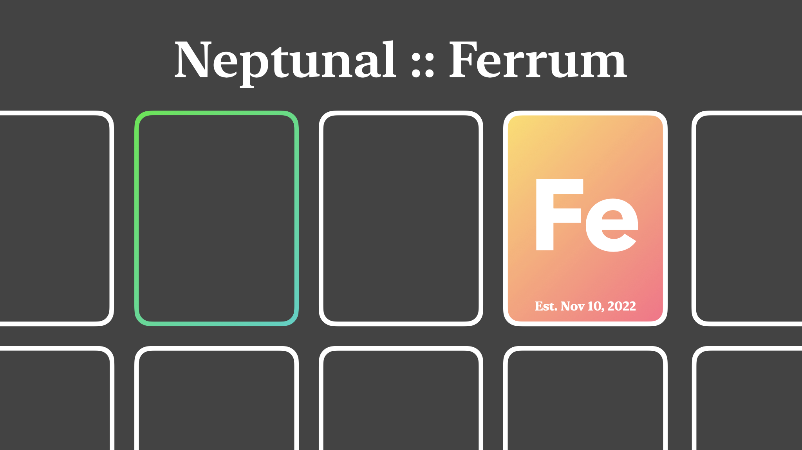

---

# **Ferrum:** based math has arrived

Ferrum is a Rust math library designed to build some **very cool** math-related functions and projects without relying on other libraries.

In addition to refusing math libraries, I also chose to ignore built-in complex number functionality and the exponentiation operator. Everything here is built from scratch; I like my math completely homemade.

This is a personal project, so I'll be focusing less on speed (although this is indeed Rust),
and new stuff will only be added when I feel like adding it.

## **We have:** *(so far)*

- Complex number and quaternion structs, with `+ - * /` implemented between both these and `f32` real numbers

- Polynomial type; includes evaluation, `+ - *`, calculus, and complete complex solving using Newton's method

- The complex exponential function using Taylor series

- The complex natural logarithm using its Taylor series and extensive range-fixing

- Full complex exponentiation and logarithms using both of these

- Trigonometric (and hyperbolic trig) functions using the exponential

- Inverse trigonometric (and inverse hyperbolic trig) funtions using the logarithm and roots

- A constant `BASED` that's always `true`

*(See the function details and math concepts in
[doc.md](./doc.md))*

*(More on the way — find it in
[todo.md](./todo.md))*

---

Watch me attempt to use this math to create a calculator with user-input in
[Titanium](https://github.com/nptnl/titanium),
and see a few visual applications for the math at
[Chromium](https://github.com/nptnl/chromium).